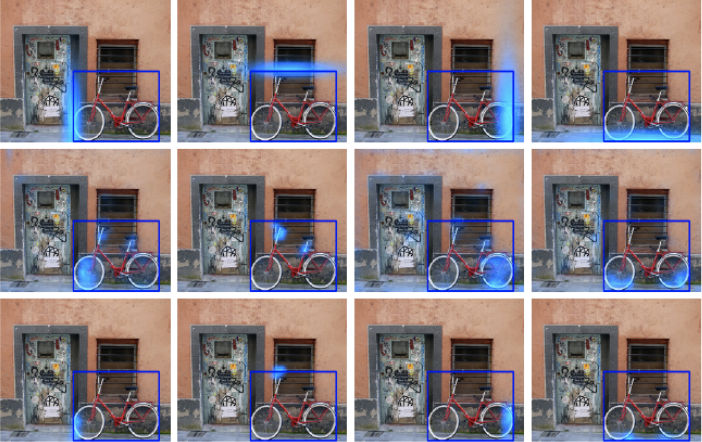
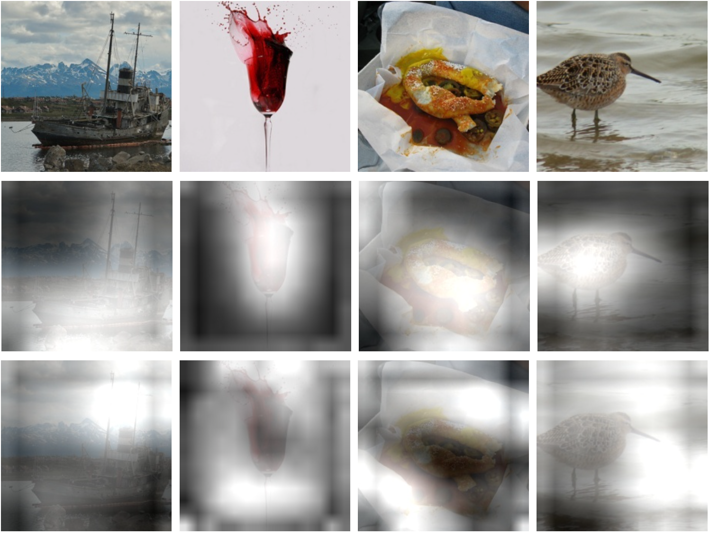
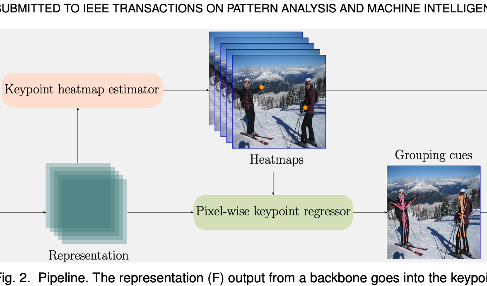
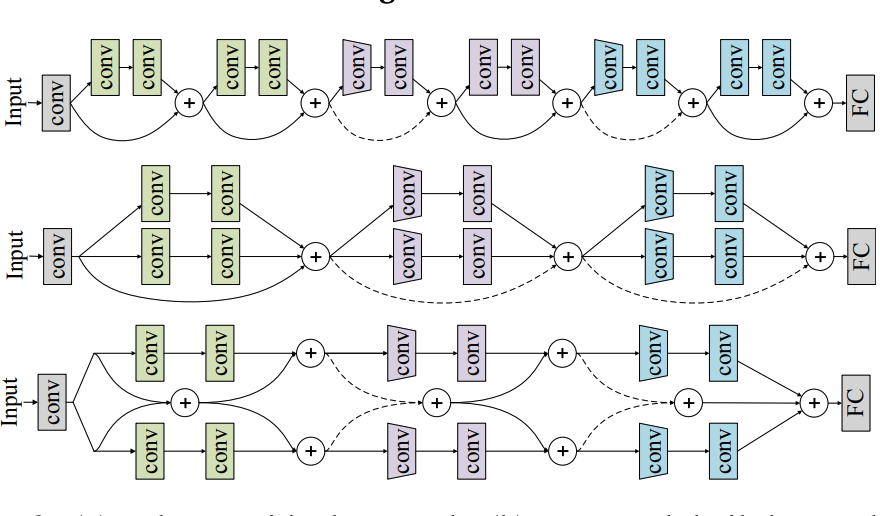

<head>
  <link rel="stylesheet" href="../assets/css/style.css">
</head>

Depu Meng is a forth-year Joint-Ph. D. student at University of Science and Technology of China (USTC) and Microsoft Research Asia (MSRA).
His advisors are [Dr. Baining Guo](https://www.microsoft.com/en-us/research/people/bainguo/) and [Prof. Houqiang Li](http://staff.ustc.edu.cn/~lihq/en/), he was also advised by [Dr. Jingdong Wang](https://jingdongwang2017.github.io/) previously.
He interned at Microsoft Research Asia during 2017-2018, and 2019-2021. He is currently a research intern at Meituan.
Here is my [CV](../files/CV.pdf).

His research interests include *2D/3D object detection, motion prediction, unsupervised representation learning*, etc. He has great passion in computer vision research.

[Education](#education)
======
* *Sept. 2018 - Jun. 2023 (expected)*  
  **Ph.D. student**  
  School of Information Science and Technology, major in Automation  
  University of Science and Technology of China  
  Supervisor: Dr. Jingdong Wang and Prof. Houqiang Li
* *Sept. 2014 - Jun. 2018*  
  **B.S. student**  
  School of the Gifted Young (SCGY), major in Electrical Engineering  
  University of Science and Technology of China

[Work Experience](#work-experience)
======
* *(Incoming) Apr. 2022 - Mar. 2023*  
  **Visiting Scholar**  
  Michigan Traffic Lab, University of Michigan, Ann Arbor  
  Mentor: [Prof. Henry Liu](https://traffic.engin.umich.edu/)
* *Aug. 2021 - Apr. 2022*  
  **Research Intern**  
  Autonomous Delivery Group, Meituan  
  Mentor: [Dr. Changqiang Yu](https://www.changqianyu.me/)
* *Jul. 2019 - Jul. 2021*  
  **Research Intern**  
  Visual Computing Group, Microsoft Research Asia  
  Mentor: Dr. Jingdong Wang
* *Jul. 2017 - Jul. 2018*  
  **Research Intern**  
  Visual Computing Group, Microsoft Research Asia  
  Mentor: Dr. Jingdong Wang

[Publications](#publications)
======

<table>
 <tr>
    <td></td>
    <td width="68%">
            <u>Depu Meng</u>*, Xiaokang Chen*, Zejia Fan, Gang Zeng, Houqiang Li, Yuhui Yuan, Lei Sun and Jingdong Wang (*: Equal Contribution)
             
            <strong>Conditional DETR for Fast Training Convergence</strong>
             
            <em><i>International Conference on Computer Vision (<strong>ICCV</strong>)</i>, 2021</em>
             
            [<a href="https://arxiv.org/abs/2108.06152" target="_blank">Paper</a>] [<a href="https://github.com/Atten4Vis/ConditionalDETR" target="_blank">Code</a>]
             
        </td>
 </tr>
 <tr>
    <td></td>
    <td width="68%">
            <u>Depu Meng</u>, Zigang Geng, Zhirong Wu, Bin Xiao, Houqiang Li and Jingdong Wang
             
            <strong>Consistent Instance Classification for Unsupervised Representation Learning</strong>
             
            <em><i>ICCV Workshop: Self-supervised Learning for Next-Generation Industry-level Autonomous Driving (<strong>ICCV Workshop</strong>)</i>, 2021</em>
             
            [<a href="https://sslad2021.github.io/files/2.pdf" target="_blank">Paper</a>]
             
        </td>
 </tr>
 <tr>
    <td></td>
    <td width="68%">
            Ke Sun, Zigang Geng, <u>Depu Meng</u>, Bin Xiao, Dong Liu, Zhaoxiang Zhang, Jingdong Wang
             
            <strong>Bottom-Up Human Pose Estimation by Ranking Heatmap-Guided Adaptive Keypoint Estimates</strong>
             
            <em><i>Arxiv</i>, 2020</em>
             
            [<a href="https://arxiv.org/abs/2006.15480" target="_blank">Paper</a>]
             
        </td>
 </tr>
 <tr>
    <td></td>
    <td width="68%">
            Liming Zhao, Mingjie Li, <u>Depu Meng</u>, Xi Li, Zhaoxiang Zhang, Yueting Zhuang, Zhuowen Tu, Jingdong Wang
             
            <strong>Deep Convolutional Neural Networks with Merge-and-Run Mappings</strong>
             
            <em><i>International Joint Conference on Artificial Intelligence (<strong>IJCAI</strong>)</i>, 2018</em>
             
            [<a href="https://www.ijcai.org/Proceedings/2018/0440.pdf" target="_blank">Paper</a>] [<a href="https://github.com/zlmzju/fusenet" target="_blank">Code</a>]
             </td>
 </tr>
</table>

[Services](#services)
======
* Conference Reviewer: CVPR 2022, ECCV 2022