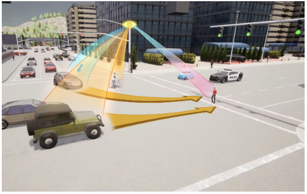
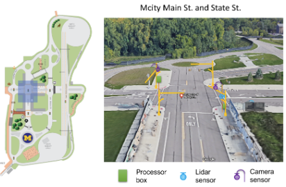
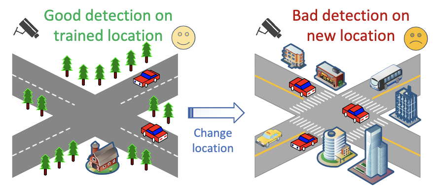
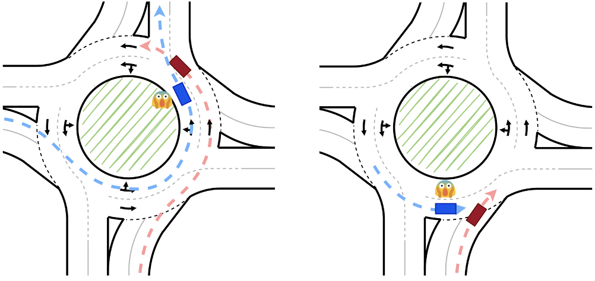
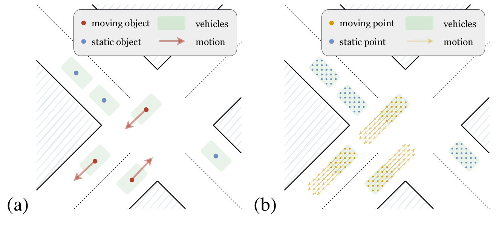
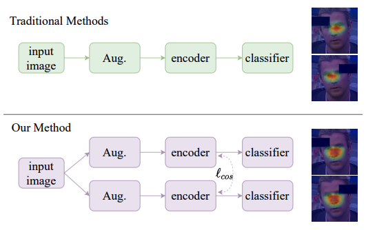

<head>
  <link rel="stylesheet" href="../assets/css/style.css">
</head>

Depu Meng is a Post-Doctoral Reseach Fellow at the University of Michigan, working with [Dr. Henry X. Liu](https://traffic.engin.umich.edu/).
He received the Ph. D. degree in the Department of Automation, University of Science and Technology of China.
His Ph. D. advisors are [Dr. Baining Guo](https://www.microsoft.com/en-us/research/people/bainguo/) and [Prof. Houqiang Li](http://staff.ustc.edu.cn/~lihq/en/), he was also advised by [Dr. Jingdong Wang](https://jingdongwang2017.github.io/) previously.
He interned at Microsoft Research Asia during 2017-2018, and 2019-2021. He also interned at Meituan
during 2021-2022. He was a visiting scholar at the University of Michigan during 2022-2023.
Here is my [CV](../files/CV.pdf).

His research interests include *traffic safety research, 2D/3D object detection, motion prediction*, etc. He has great passion in  transportation research and computer vision.

[Education](#education)
======
* *Sept. 2018 - Jun. 2023*  
  **Ph.D.**  
  School of Information Science and Technology, major in Control Science and Engineering  
  University of Science and Technology of China  
  Supervisor: Dr. Baining Guo and Prof. Houqiang Li
* *Sept. 2014 - Jun. 2018*  
  **B.E.**  
  School of the Gifted Young (SCGY), major in Electrical Engineering  
  University of Science and Technology of China

[Work Experience](#work-experience)
======
* *Jun. 2023 - present*  
  **Post-Doctoral Research Fellow**  
  Michigan Traffic Lab, University of Michigan  
  Mentor: [Prof. Henry Liu](https://traffic.engin.umich.edu/)
* *Apr. 2022 - Jun. 2023*  
  **Visiting Scholar**  
  Michigan Traffic Lab, University of Michigan  
  Mentor: [Prof. Henry Liu](https://traffic.engin.umich.edu/)
* *Aug. 2021 - Apr. 2022*  
  **Research Intern**  
  Autonomous Delivery Group, Meituan  
  Mentor: [Dr. Changqiang Yu](https://www.changqianyu.me/)
* *Jul. 2019 - Jul. 2021*  
  **Research Intern**  
  Visual Computing Group, Microsoft Research Asia  
  Mentor: Dr. Jingdong Wang
* *Jul. 2017 - Jul. 2018*  
  **Research Intern**  
  Visual Computing Group, Microsoft Research Asia  
  Mentor: Dr. Jingdong Wang

[Publications](#publications)
======

<table>
 <tr>
    <td></td>
    <td width="68%">
            Rusheng Zhang*, <u>Depu Meng*</u>, Shengyin Shen, Zhengxia Zou, Houqiang Li, Henry X. Liu
             
            <strong>MSight: An Edge-Cloud Infrastructure-based Perception System for Connected Automated Vehicles</strong>
             
            <em><i>In Submissions</i></em>
             
            [<a href="https://arxiv.org/abs/2310.05290" target="_blank">Paper</a>]
        </td>
 </tr>
 <tr>
    <td></td>
    <td width="68%">
            Rusheng Zhang, <u>Depu Meng</u>, Tinghan Wang, Tai Karir, Shengyin Shen, Michael Maile, Michael Shulman, Henry X. Liu
             
            <strong>Systematic Assessment of Roadside Perception Systems for Automated Vehicles: Insights from Field Testing</strong>
             
            <em><i>Transportation Research Board Annual Meeting (<strong>TRBAM</strong>), 2024</i></em>
             
            [<a href="https://arxiv.org/abs/2401.12392" target="_blank">Paper</a>]
        </td>
 </tr>
 <tr>
    <td></td>
    <td width="68%">
            Rusheng Zhang, <u>Depu Meng</u>, Lance Bassett, Shengyin Shen, Zhengxia Zou, Henry X. Liu
             
            <strong>Robust Roadside Perception for Autonomous Driving: an Annotation-free Strategy with Synthesized Data</strong>
             
            <em><i>IEEE Transactions on Intelligent Vehicles</i></em>
             
            [<a href="https://arxiv.org/abs/2306.17302" target="_blank">Paper</a>]
        </td>
 </tr>
 <tr>
    <td></td>
    <td width="68%">
            <u>Depu Meng</u>, Owen Sayer, Rusheng Zhang, Shengyin Shen, Houqiang Li, Henry X. Liu
             
            <strong>ROCO: A Roundabout Traffic Conflict Dataset</strong>
             
            <em><i>Transportation Research Board Annual Meeting (<strong>TRBAM</strong>), 2023</i></em>
             
            [<a href="https://arxiv.org/abs/2303.00563" target="_blank">Paper</a>]
            [<a href="https://github.com/michigan-traffic-lab/ROCO" target="_blank">Data</a>]
        </td>
 </tr>
 <tr>
    <td></td>
    <td width="68%">
            <u>Depu Meng</u>, Changqian Yu, Jiajun Deng, Deheng Qian, Houqiang Li, Dongchun Ren
             
            <strong>Hybrid Motion Representation Learning for Prediction from Raw Sensor Data</strong>
             
            <em><i>IEEE Transactions on Multimedia (<strong>T-MM</strong>), 2023</i></em>
             
            [<a href="https://ieeexplore.ieee.org/abstract/document/10040996" target="_blank">Paper</a>]
             
        </td>
 </tr>
 <tr>
    <td></td>
    <td width="68%">
            Yunsheng Ni, <u>Depu Meng</u>, Changqian Yu, Chengbin Quan, Dongchun Ren, Youjian Zhao
             
            <strong>CORE: COnsistent REpresentation Learning for Face Forgery Detection</strong>
             
            <em><i>CVPR Workshop on Media Forensics (<strong>CVPR Workshop</strong>)</i>, 2022</em>
             
            [<a href="https://arxiv.org/abs/2206.02749" target="_blank">Paper</a>] [<a href="https://github.com/niyunsheng/CORE" target="_blank">Code</a>]
             
        </td>
 </tr>
 <tr>
    <td></td>
    <td width="68%">
            <u>Depu Meng</u>*, Xiaokang Chen*, Zejia Fan, Gang Zeng, Houqiang Li, Yuhui Yuan, Lei Sun and Jingdong Wang (*: Equal Contribution)
             
            <strong>Conditional DETR for Fast Training Convergence</strong>
             
            <em><i>International Conference on Computer Vision (<strong>ICCV</strong>)</i>, 2021</em>
             
            [<a href="https://arxiv.org/abs/2108.06152" target="_blank">Paper</a>] [<a href="https://github.com/Atten4Vis/ConditionalDETR" target="_blank">Code</a>] [<a href="https://huggingface.co/docs/transformers/main/model_doc/conditional_detr" target="_blank">HuggingFace</a>]
             
        </td>
 </tr>
 <tr>
    <td></td>
    <td width="68%">
            <u>Depu Meng</u>, Zigang Geng, Zhirong Wu, Bin Xiao, Houqiang Li and Jingdong Wang
             
            <strong>Consistent Instance Classification for Unsupervised Representation Learning</strong>
             
            <em><i>ICCV Workshop: Self-supervised Learning for Next-Generation Industry-level Autonomous Driving (<strong>ICCV Workshop</strong>)</i>, 2021</em>
             
            [<a href="https://sslad2021.github.io/files/2.pdf" target="_blank">Paper</a>]
             
        </td>
 </tr>
 <tr>
    <td></td>
    <td width="68%">
            Ke Sun, Zigang Geng, <u>Depu Meng</u>, Bin Xiao, Dong Liu, Zhaoxiang Zhang, Jingdong Wang
             
            <strong>Bottom-Up Human Pose Estimation by Ranking Heatmap-Guided Adaptive Keypoint Estimates</strong>
             
            <em><i>Arxiv</i>, 2020</em>
             
            [<a href="https://arxiv.org/abs/2006.15480" target="_blank">Paper</a>]
             
        </td>
 </tr>
 <tr>
    <td></td>
    <td width="68%">
            Liming Zhao, Mingjie Li, <u>Depu Meng</u>, Xi Li, Zhaoxiang Zhang, Yueting Zhuang, Zhuowen Tu, Jingdong Wang
             
            <strong>Deep Convolutional Neural Networks with Merge-and-Run Mappings</strong>
             
            <em><i>International Joint Conference on Artificial Intelligence (<strong>IJCAI</strong>)</i>, 2018</em>
             
            [<a href="https://www.ijcai.org/Proceedings/2018/0440.pdf" target="_blank">Paper</a>] [<a href="https://github.com/zlmzju/fusenet" target="_blank">Code</a>]
             </td>
 </tr>
</table>

[Services](#services)
======
* Conference Reviewer: CVPR 2022, CVPR 2023, ECCV 2022, CICAI 2022, ICCV 2023, TRBAM 2023, TRBAM 2024
* Journal Reviewer: IEEE T-IV, IEEE T-MM, IEEE T-CSVT, Neuralcomputing