<head>
  <link rel="stylesheet" href="../assets/css/style.css?v=20260827">
</head>

Depu Meng is a Senior Research Engineer and Technical Lead at Applied Intuition, where he leads world foundation model development for physical AI. His work focuses on omni-modal foundation model training, 3D reconstruction and generation, and multimodal learning.

Previously, he was a Postdoctoral Research Fellow at the University of Michigan. He earned his Ph.D. through a joint program between Microsoft Research Asia and the University of Science and Technology of China. [Download his CV](../files/CV.pdf).

[Work Experience](#work-experience)
======
* *Sep. 2025 - present*  
  **Senior Research Engineer, Technical Lead**  
  AI Research, Applied Intuition  
  Lead world foundation model development for physical AI, including omni-modal foundation model training and methods for 3D reconstruction and generation.
* *Dec. 2024 - Aug. 2025*  
  **Machine Learning Engineer**  
  AI Research, DiDi Autonomous Driving  
  Developed end-to-end autonomous driving models and 3D reconstruction systems.
* *Aug. 2023 - Dec. 2024*  
  **Postdoctoral Research Fellow**  
  Mobility Transformation Lab, University of Michigan  
  Conducted traffic safety research and developed a full perception suite spanning object detection, multi-object tracking, sensor fusion, and near-miss and collision identification.
  Mentor: [Prof. Henry X. Liu](https://traffic.engin.umich.edu/)
* *Apr. 2022 - Jul. 2023*  
  **Visiting Scholar**  
  Mobility Transformation Lab, University of Michigan  
  Worked on traffic safety research and roadside perception for connected and automated vehicles.
  Mentor: [Prof. Henry X. Liu](https://traffic.engin.umich.edu/)
* *Aug. 2021 - Apr. 2022*  
  **Research Intern**  
  Autonomous Delivery Group, Meituan  
  Developed joint perception and motion prediction models for autonomous driving.
  Mentor: [Dr. Changqiang Yu](https://yu-changqian.github.io/)
* *Jul. 2019 - Jul. 2021*, *Jul. 2017 - Jul. 2018*    
  **Research Intern**  
  Visual Computing Group, Microsoft Research Asia  
  Researched object detection, Transformer architectures, and self-supervised representation learning.
  Mentor: [Dr. Jingdong Wang](https://jingdongwang2017.github.io/)

[Education](#education)
======
* *Sept. 2018 - Jun. 2023*  
  **Ph.D.**  
  Control Science and Engineering  
  Joint Ph.D. Program, Microsoft Research Asia - University of Science and Technology of China  
  Supervisor: Dr. Baining Guo and Prof. Houqiang Li
* *Sept. 2014 - Jun. 2018*  
  **B.E.**  
  School of the Gifted Young, major in Electrical Engineering  
  University of Science and Technology of China

[Selected Publications](#publications)
======

* Equal contribution, &dagger; Project lead

<table>
 <tr>
    <td>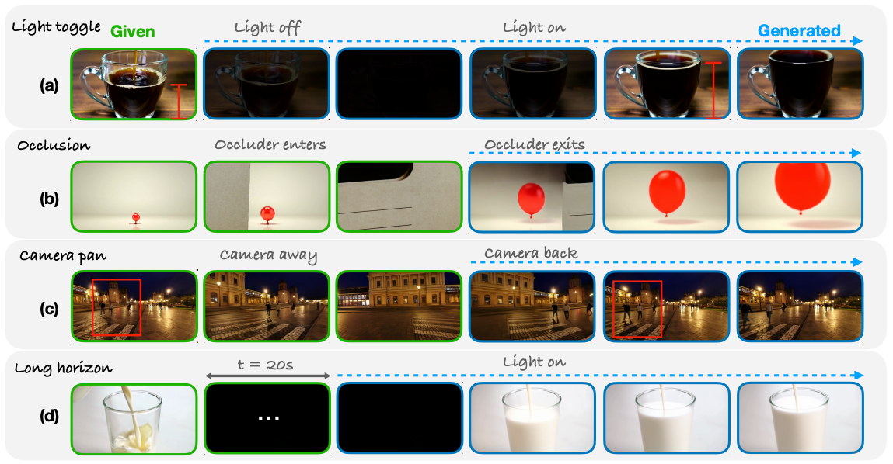</td>
    <td width="68%">
            Tianshuo Xu, Yichen Xie, <u>Depu Meng&dagger;</u>, Chensheng Peng, Quentin Herau, Bo Jiang, Yihan Hu, Wei Zhan
             
            <strong>Teaching Video Generators to Remember: Eliciting Dynamic Memory for Out-of-Sight State Evolution</strong>
             
            <em><i>arXiv, 2026</i></em>
             
            [<a href="https://arxiv.org/abs/2605.25333" target="_blank">Paper</a>]
            [<a href="https://remind-applied.github.io/" target="_blank">Project</a>]
            [<a href="https://github.com/Applied-Intuition-Open-Source/ReMind" target="_blank">Code</a>]
            [<a href="https://huggingface.co/AppliedIntuitionResearch/ReMind" target="_blank">Model</a>]
            [<a href="https://huggingface.co/datasets/AppliedIntuitionResearch/ReMind1M" target="_blank">Dataset</a>]
        </td>
 </tr>
 <tr>
    <td>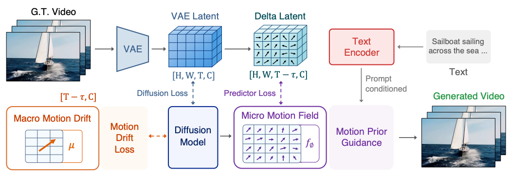</td>
    <td width="68%">
            Bo Jiang, <u>Depu Meng</u>, Yihan Hu, Yichen Xie, Tianshuo Xu, Wei Zhan
             
            <strong>LaMo: Self-Supervised Latent Motion Priors for Physical Realism in Video Generation</strong>
             
            <em><i>arXiv, 2026</i></em>
             
            [<a href="https://arxiv.org/abs/2605.23878" target="_blank">Paper</a>]
            [<a href="https://lamo-ai.github.io/" target="_blank">Project</a>]
            [<a href="https://github.com/Applied-Intuition-Open-Source/LaMo" target="_blank">Code</a>]
        </td>
 </tr>
 <tr>
    <td>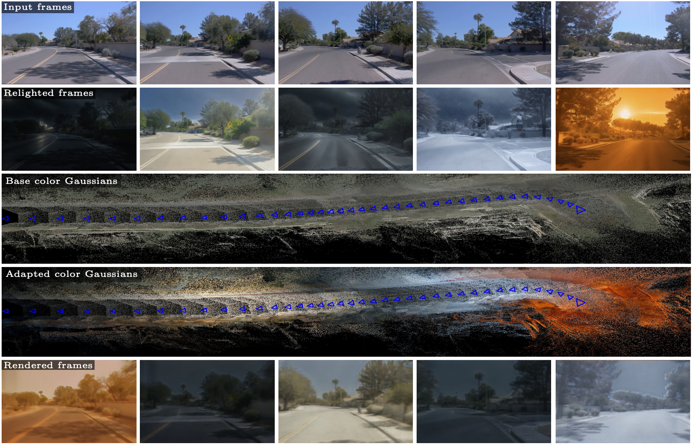</td>
    <td width="68%">
            Quentin Herau*, Tianshuo Xu*, <u>Depu Meng&dagger;</u>, Zhijie Yang, Chensheng Peng, Spencer Sherk, Yihan Hu, Wei Zhan
             
            <strong>SpectralSplat: Appearance-Disentangled Feed-Forward Gaussian Splatting for Driving Scenes</strong>
             
            <em><i>arXiv, 2026</i></em>
             
            [<a href="https://arxiv.org/html/2604.03462v1" target="_blank">Paper</a>]
        </td>
 </tr>
 <tr>
    <td>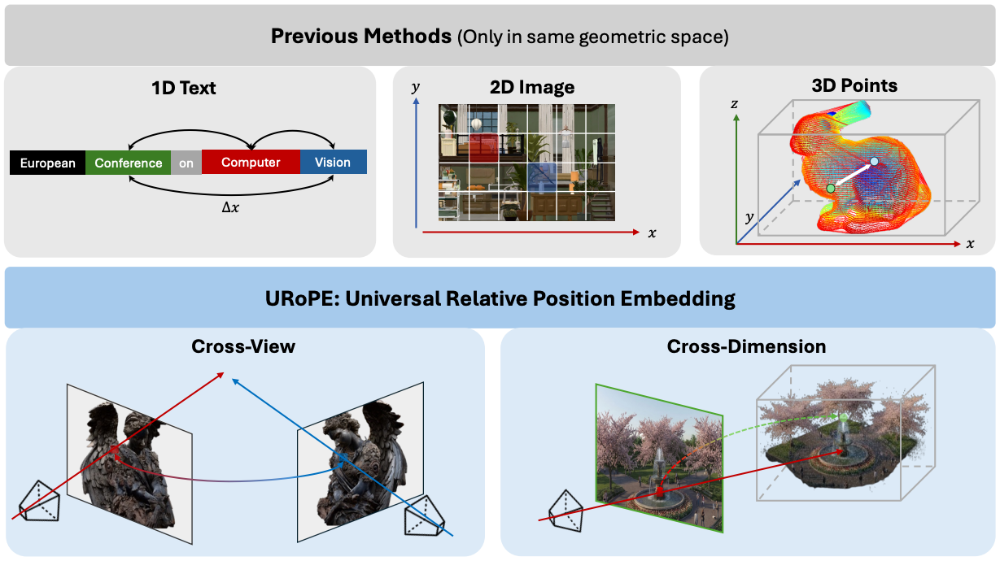</td>
    <td width="68%">
            Yichen Xie, <u>Depu Meng</u>, Chensheng Peng, Yihan Hu, Quentin Herau, Masayoshi Tomizuka, Wei Zhan
             
            <strong>URoPE: Universal Relative Position Embedding across Geometric Spaces</strong>
             
            <em><i>ECCV, 2026 <b>(Spotlight)</b></i></em>
             
            [<a href="https://arxiv.org/abs/2604.18747" target="_blank">Paper</a>]
            [<a href="https://urope-pe.github.io/" target="_blank">Project</a>]
            [<a href="https://github.com/Applied-Intuition-Open-Source/URoPE" target="_blank">Code</a>]
        </td>
 </tr>
 <tr>
    <td>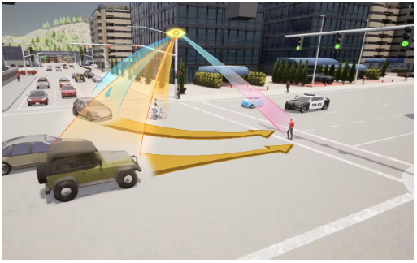</td>
    <td width="68%">
            Rusheng Zhang*, <u>Depu Meng*</u>, Shengyin Shen, Zhengxia Zou, Houqiang Li, Henry X. Liu
             
            <strong>MSight: An Edge-Cloud Infrastructure-based Perception System for Connected Automated Vehicles</strong>
             
            <em><i>Tech Report</i></em>
             
            [<a href="https://arxiv.org/abs/2310.05290" target="_blank">Paper</a>] [<a href="https://github.com/michigan-traffic-lab/MSight" target="_blank">Code</a>]
        </td>
 </tr>
 <!-- <tr>
    <td>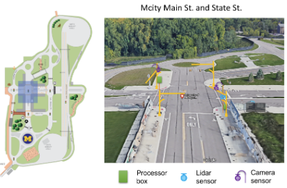</td>
    <td width="68%">
            Rusheng Zhang, <u>Depu Meng</u>, Tinghan Wang, Tai Karir, Shengyin Shen, Michael Maile, Michael Shulman, Henry X. Liu
             
            <strong>Systematic Assessment of Roadside Perception Systems for Automated Vehicles: Insights from Field Testing</strong>
             
            <em><i>Transportation Research Board Annual Meeting (<strong>TRBAM</strong>), 2024</i></em>
             
            [<a href="https://arxiv.org/abs/2401.12392" target="_blank">Paper</a>]
        </td>
 </tr> -->
 <tr>
    <td>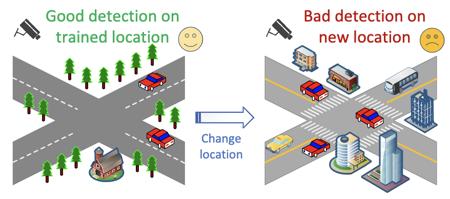</td>
    <td width="68%">
            Rusheng Zhang, <u>Depu Meng</u>, Lance Bassett, Shengyin Shen, Zhengxia Zou, Henry X. Liu
             
            <strong>Robust Roadside Perception: an Automated Data Synthesis Pipeline Minimizing Human Annotation</strong>
             
            <em><i>IEEE Transactions on Intelligent Vehicles (<strong>T-IV</strong>) & U.S. Patent, 2024</i></em>
             
            [<a href="https://arxiv.org/abs/2306.17302" target="_blank">Paper</a>]
        </td>
 </tr>
 <tr>
    <td>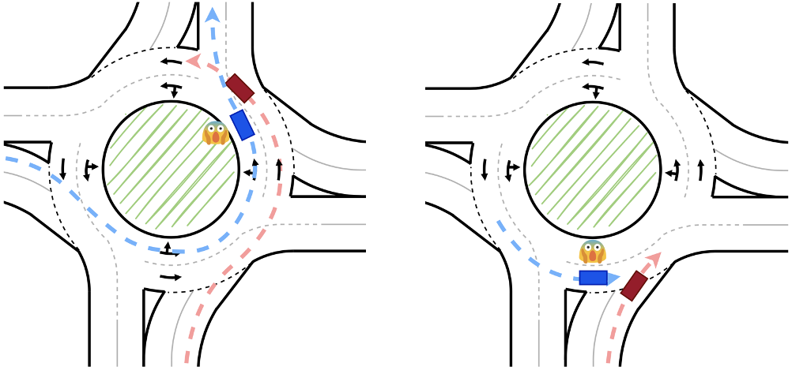</td>
    <td width="68%">
            <u>Depu Meng</u>, Owen Sayer, Rusheng Zhang, Shengyin Shen, Houqiang Li, Henry X. Liu
             
            <strong>ROCO: A Roundabout Traffic Conflict Dataset</strong>
             
            <em><i>Transportation Research Board Annual Meeting (<strong>TRBAM</strong>), 2023</i></em>
             
            [<a href="https://arxiv.org/abs/2303.00563" target="_blank">Paper</a>]
            [<a href="https://github.com/michigan-traffic-lab/ROCO" target="_blank">Data</a>]
        </td>
 </tr>
 <tr>
    <td>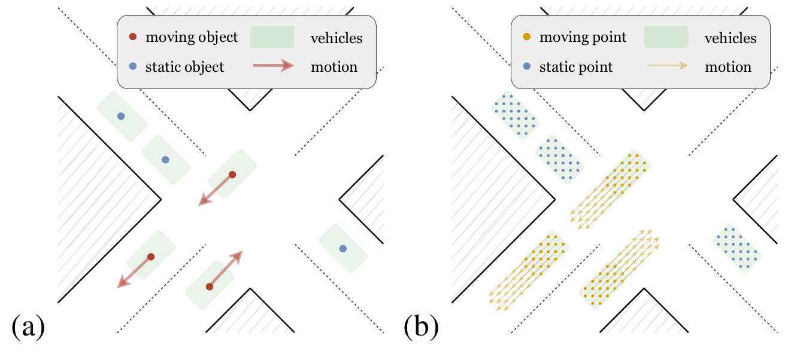</td>
    <td width="68%">
            <u>Depu Meng</u>, Changqian Yu, Jiajun Deng, Deheng Qian, Houqiang Li, Dongchun Ren
             
            <strong>Hybrid Motion Representation Learning for Prediction from Raw Sensor Data</strong>
             
            <em><i>IEEE Transactions on Multimedia (<strong>T-MM</strong>), 2023</i></em>
             
            [<a href="https://ieeexplore.ieee.org/abstract/document/10040996" target="_blank">Paper</a>]
             
        </td>
 </tr>
 <tr>
    <td>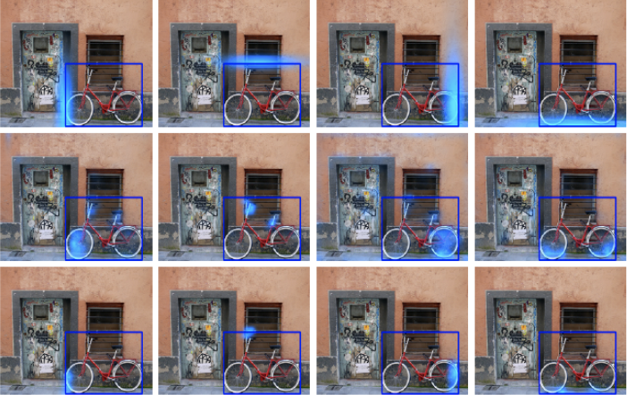</td>
    <td width="68%">
            <u>Depu Meng</u>*, Xiaokang Chen*, Zejia Fan, Gang Zeng, Houqiang Li, Yuhui Yuan, Lei Sun and Jingdong Wang (*: Equal Contribution)
             
            <strong>Conditional DETR for Fast Training Convergence</strong>
             
            <em><i>International Conference on Computer Vision (<strong>ICCV</strong>)</i>, 2021</em>
             
            [<a href="https://arxiv.org/abs/2108.06152" target="_blank">Paper</a>] [<a href="https://github.com/Atten4Vis/ConditionalDETR" target="_blank">Code</a>] [<a href="https://huggingface.co/docs/transformers/main/model_doc/conditional_detr" target="_blank">Model</a>]
             
        </td>
 </tr>
 <!-- <tr>
    <td>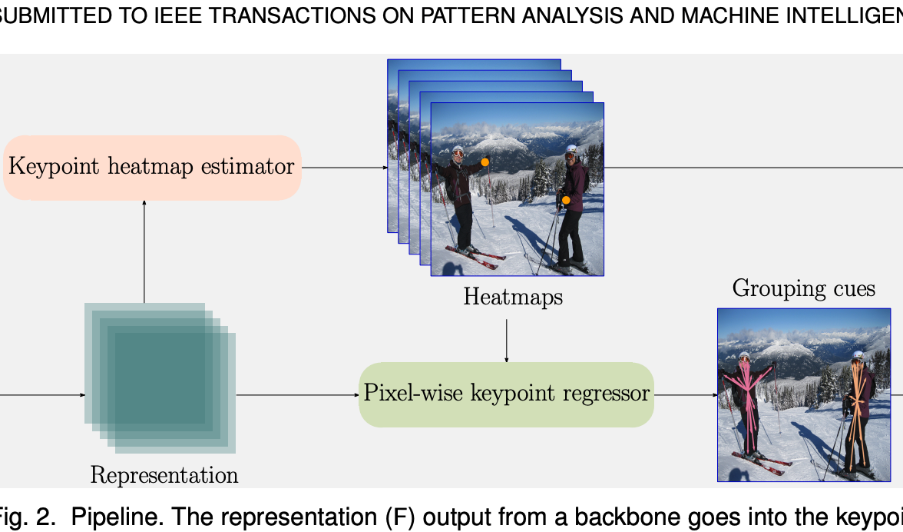</td>
    <td width="68%">
            Ke Sun, Zigang Geng, <u>Depu Meng</u>, Bin Xiao, Dong Liu, Zhaoxiang Zhang, Jingdong Wang
             
            <strong>Bottom-Up Human Pose Estimation by Ranking Heatmap-Guided Adaptive Keypoint Estimates</strong>
             
            <em><i>arXiv</i>, 2020</em>
             
            [<a href="https://arxiv.org/abs/2006.15480" target="_blank">Paper</a>]
             
        </td>
 </tr> -->
</table>

[Services](#services)
======
* Conference Reviewer: CVPR, ECCV, ICCV, NeurIPS, ACM MM, IROS 
* Journal Reviewer: IJCV, IEEE T-IV, IEEE T-MM, IEEE T-CSVT, Neurocomputing, Pattern Recognition
